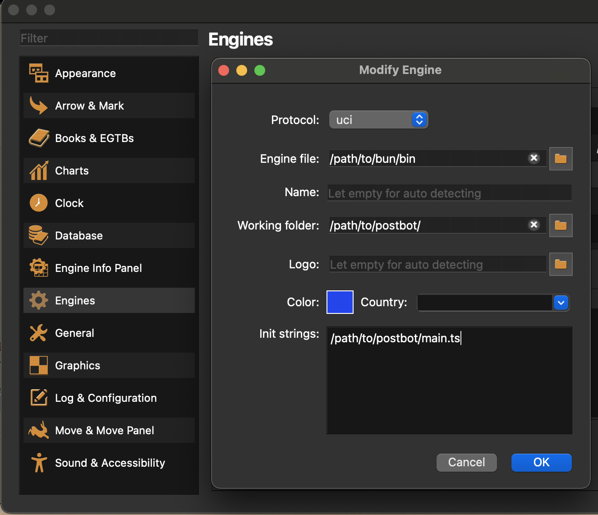

> **⚠ WARNING: This is a beta version**  
> This app is in early development. Some features may be broken. Use at your own risk.
----------

# postbot
This is _postbot_ an UCI chess engine written in Typescript. It's my second attempt to write a chess engine, since I wrote Canalla back in 2003 (C++ UCI chess engine competing in some [private tournaments](http://www.open-aurec.com/chesswar/Chesswar017/Chesswar017PSt.htm)). Since _postbot_ is written in TypeScript and compiled to JavaScript running in a linux docker container on my Raspberry Pi 4 it won't be breaking performance records but it's a fun project.

## postbot on lichess
Play against the current version on lichess. You can play rated and casual games.

lichess: https://lichess.org/@/postbot

postbot is running on a Raspberry Pi 4.

## postbot on your local machine

### Installation
```
git clone https://github.com/postnerd/postbot.git
npm install
npm build
```

### Analysing via terminal
You can analyse a position via terminal giving a fen and then starting the search.

```
npm start
```

Set position you want so analyse:
```
postion fen <fen_string> OR postion fen <fen_string> moves <moves>
```

To start analysing you have a few options

#### Infinite
Analyse the given position until you stop it.
```
go infinite
```

You can stop by typing 'stop'.

#### Depth
Analyse the given position until the search reaches a certain ply on the search tree.
```
go depth <n>
```

#### Movetime
Analyse the given position for a specified time.
```
go movetime <time in ms>
```

#### Examples
```
position startpos
go depth 8
```

```
position fen 8/8/7p/3KNN1k/2p4p/8/3P2p1/8 w - -
go infinite
```

```
position fen 8/8/7p/3KNN1k/2p4p/8/3P2p1/8 b - - moves d5c6
go movetime 10000
```

You can stop a search by typing 'stop' and quit postbot by typing 'quit'.

If you know the UCI specification you can even play a full game in the terminal, but it's not that comfortable. But you can use a chess GUI to play agains _postbot_ on your local machine.

### Playing/Analysing via a chess GUI
I'm using [BanksiaGUI](https://banksiagui.com/) but it should also work with other GUIs (e.g. ChessX / Arena) as long as they support starting a node process with an init string.

#### Installation in BanksiaGUI
Go to _Preferences_ -> _Engines_ and click the little "+"-Button in the upper right.

Than fill in the requested informations like this:



**_Make sure you have entered the correct path to your local postbot installation and performed a ```npm run build```._**

After this BanksiaGUI should auto detect the name and you are ready to analyse and play games against _postbot_.

## Bringing your own version of postbot to lichess
If you have modified _postbot_ and want so see it playing on lichess against other bots, you can use the postbot [Dockerfile](lichess/Dockerfile) for building a docker container. For more information on this please take a look at the [lichess subfolder](lichess/readme.md).

## Changelog
### postbot 0.2.1-beta – 05.01.2023
- performance optimizations
    - improved move generation for castle moves
- code improvements

### postbot 0.2.0-beta – 05.11.2023
- performance optimizations
    - generate pseudo legal moves and validate them only right before using them
    - aspiration windows for search
    - best move caching in capture search
- optimized docker setup to release new version on lichess by restarting docker container
- ability to install postbot as a global node packages

### postbot 0.1.0-beta – 12.10.2023 :tada:
- finally a complete implementation of all important chess rules (50 move rule, stalemate etc.)
- transposition tables 1.0 for main search
- added endgame piece-square tables to the evaluation
- enhanced time management when playing with increment
- bugfixes (hash, castle rights)
- added perft tests

### postbot 0.0.4-alpha – 01.10.2023
- basic evaluation based on piece-square tables for middle game
- new hash table implementation to reduce hash collisions
- evaluation score caching
- updated move list sorting (MVV-LVA and killer moves)

### postbot 0.0.3-alpha – 27.09.2023
- search optimizations by adding alpha beta pruning and quiesce search
- basic move ordering to evaluate former best moves and capture moves first

### postbot 0.0.2-alpha – 19.09.2023
- launched postbot on lichess
- basic evaluation and search algorithm
- basic hash table implementation
- search is handled by a worker thread to ensure proper communication between engine and GUI/lichess 
- engine supports game and analyze mode via uci

### postbot 0.0.1-alpha – 06.07.2023
- launched postbotR (little brother of postbot) on lichess
- basic board representation and move generator
- basic uci communication supporting to start from position